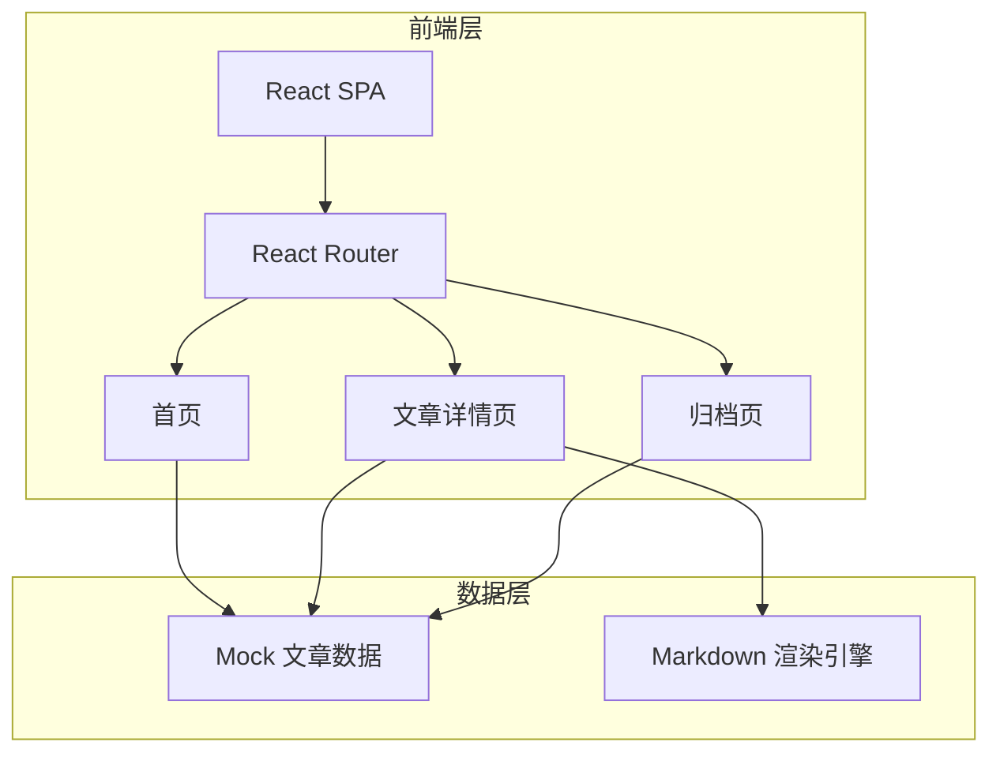

## 1. 架构设计



## 2. 技术说明

- **前端框架**：React@18 + TypeScript
- **样式方案**：Tailwind CSS@3 + CSS Variables（主题色）
- **构建工具**：Vite
- **路由**：React Router@6
- **Markdown 渲染**：react-markdown + remark-gfm + rehype-highlight
- **动效**：Framer Motion
- **数据**：Mock 数据（本地 JSON），无后端依赖
- **字体**：Google Fonts（Noto Serif SC + Noto Sans SC）

## 3. 路由定义

| 路由 | 用途 |
|------|------|
| `/` | 首页，展示精选和最新文章 |
| `/post/:slug` | 文章详情页，沉浸式阅读 |
| `/archives` | 归档页，时间线浏览所有文章 |

## 4. 项目结构

```
src/
├── components/        # 通用组件
│   ├── Layout.tsx     # 页面布局（导航+页脚）
│   ├── Navbar.tsx     # 顶部导航
│   ├── Footer.tsx     # 页脚
│   ├── ArticleCard.tsx # 文章卡片
│   ├── TableOfContents.tsx # 目录导航
│   └── TagCloud.tsx   # 标签云
├── pages/             # 页面组件
│   ├── Home.tsx       # 首页
│   ├── Post.tsx       # 文章详情页
│   └── Archives.tsx   # 归档页
├── data/              # Mock 数据
│   └── posts.ts       # 文章数据
├── hooks/             # 自定义 Hooks
│   └── useScrollSpy.ts # 滚动监听（目录高亮）
├── App.tsx            # 根组件+路由配置
├── main.tsx           # 入口文件
└── index.css          # 全局样式+CSS变量
```
